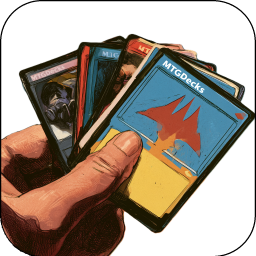

  <picture>
    <source media="(prefers-color-scheme: dark)" srcset=".github/logo/dark/256x256/MTGDecks.png">
    <source media="(prefers-color-scheme: light)" srcset=".github/logo/light/256x256/MTGDecks.png">
    
  </picture>

|     |    |
|:---:|:---|
|⚪🔵 |[Adventure](Decks/Adventure.mtg.md)  |
|🔴⚫ |[Angrath's Revenge](Decks/Angraths-Revenge.mtg.md)  |
|⚪🔵 |[Azorius Birds](Decks/AzoriusBirds.mtg.md)  |
|🔴⚫ |[Captain Lannery Storm](Decks/Captain-Lannery-Storm.mtg.md)  |
|🔴 |[Creature Killer](Decks/Creature-Killer.mtg.md)  |
|🔵🔴 |[Giant Invasion](Decks/Giant-Invasion.mtg.md)  |
|🔴 |[Quakebringer](Decks/Quakebringer.mtg.md)  |
|⚫🟢 |[Wurmpocalypse](Decks/Wurmpocalypse.mtg.md)  |
